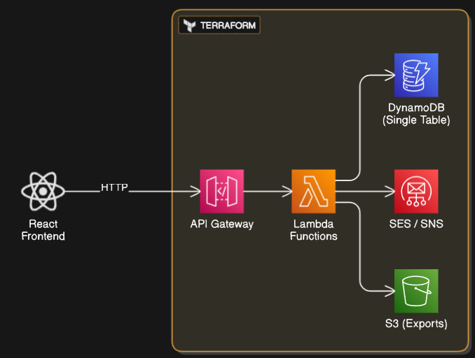

<div align="center">

# BudgetLink (W.I.P)💰
*The shareable budget builder you actually want to use*

</div>

<div align="center">


**Create → Share → Track → Repeat**

[Demo](https://budgetlink.com/demo) • [Docs](https://docs.budgetlink.com) • [Feedback](https://github.com/username/budgetlink/issues)

</div>
<details>
<summary>Architecture & Data Flow Diagram</summary>



</details>

---

## The Problem I'm Solving

Building budgets with friends, family, or roommates shouldn't require everyone to sign up for Yet Another App™. BudgetLink works like PCPartPicker but for money - create a budget, get a memorable link like `budgetlink.com/sunny-red-panda`, and share it with anyone.

**No accounts. No friction. Just budgets that work.**

## What Makes This Different

**Shareable by Design**  
Every budget gets a human-readable URL. Share it in Slack, text it to your roommate, or bookmark it for later.

**Privacy When You Need It**  
Add password protection for sensitive budgets, or create view-only tokens for stakeholders who need to see but not edit.

**Built for Speed**  
Serverless architecture means your budgets load instantly and scale automatically. No more waiting for "the app to catch up."

**Zero Barrier to Entry**  
No email verification, no password requirements, no premium tiers. Just open the site and start budgeting.

---

## Core Features

### Smart Budget Creation
- **Dynamic Categories**: Add expenses and watch categories emerge naturally
- **Recurring Logic**: Set up monthly rent once, forget about it forever  
- **Real-time Sync**: Changes appear instantly across all shared links

### Collaborative Tracking
- **Multi-contributor**: Anyone with edit access can add expenses
- **Change History**: See who added what and when

### Intelligent Insights
- **Visual Breakdown**: Interactive charts that actually help you understand your spending
- **Smart Alerts**: Get notified when you're approaching limits (email or browser)

### Export Everything
Choose your format: PDF reports, CSV data, or Excel spreadsheets. Your budget, your way.

---

## Tech framework

I built BudgetLink on AWS serverless because your budget shouldn't go down when you need it most. Here's what powers the magic:

**Frontend**: React + TypeScript for a snappy, type-safe experience  
**API Layer**: AWS API Gateway handling millions of requests effortlessly  
**Logic**: Lambda functions that wake up only when needed  
**Storage**: DynamoDB with single-table design for sub-10ms queries  
**Assets**: S3 + CloudFront for global content delivery

**Infrastructure as Code**: Everything deployed via Terraform for reproducible, version-controlled infrastructure.

---

## Quick Start

**Want to try it?** Just visit [budgetlink.###](https://budgetlink.###) and start building.

**Want to run it locally?**

```bash
# Frontend
cd frontend && npm install && npm run dev

# Infrastructure  
cd infra && terraform init && terraform apply
```

**Requirements**: Node.js 18+, AWS CLI configured, Terraform installed.

---

## Project Structure

```
BudgetLink/
├── frontend/           # React app with TypeScript
│   ├── src/components/ # Reusable UI components
│   ├── src/hooks/      # Custom React hooks
│   └── src/utils/      # Helper functions
├── infra/             # Terraform infrastructure
│   ├── modules/       # Reusable Terraform modules
│   └── environments/  # Environment-specific configs
└── docs/              # Documentation and guides
```

---

## Contributing

Found a bug? Have an idea? I'd love your help.

**Quick contributions**: Fix typos, improve docs, add examples  
**Feature requests**: Open an issue with your use case  
**Major changes**: Let's chat in Discussions first

---

## Inspiration

BudgetLink was born from frustration with existing budgeting apps that require everyone to create accounts just to split a grocery bill. I asked: "What if budgeting worked more like sharing a Google Doc or a PcPartPicker link?"

The answer is a tool that gets out of your way and lets you focus on what matters: understanding and controlling your money.

---

<div align="center">

[MIT License](LICENSE)

</div>
